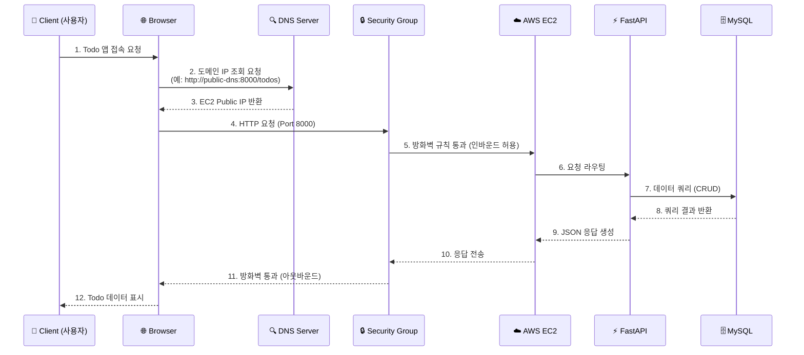
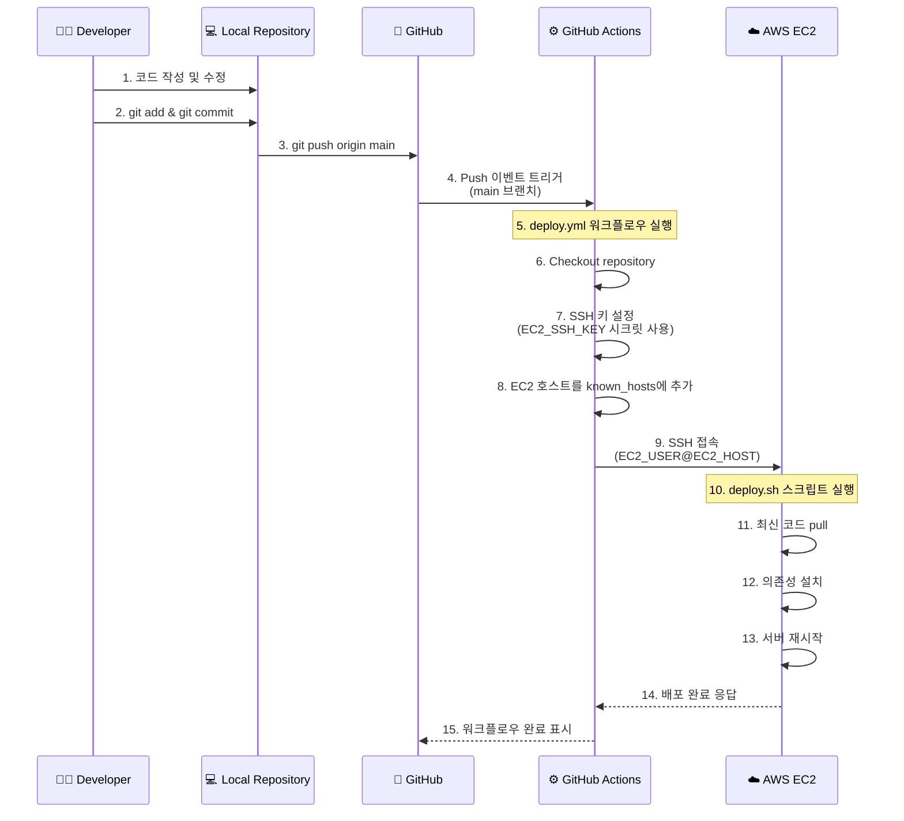

# Todo List 서버 아키텍처 문서

## 📋 개요

본 문서는 Todo List 단일 서버의 전체 시스템 구조를 시각화하고, 요청/응답 흐름 및 CI/CD 파이프라인을 설명합니다.

---

## 🏗️ Step 1-A: 기본 구성 요소

### 시스템 구성 요소 목록

| 구성 요소 | 설명 | 역할 |
|-----------|------|------|
| **Client** | 사용자 | 웹 브라우저 또는 API 클라이언트를 통해 Todo 서비스에 접근 |
| **Browser** | 브라우저 | 사용자가 HTTP 요청을 보내는 인터페이스 |
| **EC2** | AWS EC2 인스턴스 | FastAPI 애플리케이션이 실행되는 가상 서버 |
| **Security Group** | EC2의 방화벽 | 인바운드/아웃바운드 트래픽을 제어하는 보안 규칙 |
| **FastAPI** | 애플리케이션 서버 | Python 기반 웹 프레임워크, Todo CRUD API 제공 |
| **MySQL** | 데이터베이스 | Todo 데이터를 저장하는 관계형 데이터베이스 |
| **DNS Server** | DNS 서버 | 도메인 이름을 IP 주소로 변환 |
| **Developer** | 개발자 | 코드를 작성하고 GitHub에 푸시하는 역할 |
| **GitHub** | 코드 저장소 | 소스 코드 버전 관리 및 저장 |
| **GitHub Actions** | CI/CD 도구 | 자동 배포 파이프라인 실행 |

---

## 🔄 Step 1-B: 요청/응답 흐름 및 CI/CD 아키텍처

### 1. Client → FastAPI 서버 요청 흐름



### 요청 흐름 상세 설명

| 단계 | 구성 요소 | 설명 |
|------|-----------|------|
| 1 | Client → Browser | 사용자가 브라우저에서 Todo 애플리케이션 URL 입력 |
| 2 | Browser → DNS Server | 도메인 이름을 IP 주소로 변환하기 위해 DNS 서버에 질의 |
| 3 | DNS Server → Browser | EC2 인스턴스의 Public IP 주소 반환 |
| 4 | Browser → Security Group | HTTP 요청이 EC2 보안 그룹에 도달 |
| 5 | Security Group → EC2 | 포트 8000 인바운드 규칙에 따라 요청 허용 |
| 6 | EC2 → FastAPI | Uvicorn 웹 서버가 요청을 FastAPI 앱으로 전달 |
| 7 | FastAPI → MySQL | Todo 데이터 조회/생성/수정/삭제 쿼리 실행 |
| 8 | MySQL → FastAPI | 쿼리 결과 반환 |
| 9-12 | 응답 경로 | 역순으로 클라이언트까지 JSON 응답 전달 |

---

### 2. CI/CD 배포 흐름 (GitHub Actions)



### CI/CD 파이프라인 상세 설명

| 단계 | 구성 요소 | 설명 |
|------|-----------|------|
| 1-2 | Developer → Local | 개발자가 로컬에서 코드 작성 및 커밋 |
| 3 | Local → GitHub | main 브랜치로 코드 푸시 |
| 4 | GitHub → Actions | push 이벤트가 워크플로우 트리거 |
| 5-8 | GitHub Actions | SSH 환경 설정 (시크릿 활용) |
| 9 | Actions → EC2 | SSH로 EC2 서버에 원격 접속 |
| 10-13 | EC2 | deploy.sh 스크립트로 서버 업데이트 |
| 14-15 | 완료 | 배포 상태 GitHub에 반영 |

---

## 🏛️ 전체 시스템 아키텍처 다이어그램


---

## 📡 API 엔드포인트 (FastAPI)

현재 Todo 애플리케이션에서 제공하는 API:

| Method | Endpoint | 설명 | 요청 Body |
|--------|----------|------|-----------|
| `POST` | `/todos` | 새 Todo 생성 | `{"content": "할 일 내용"}` |
| `GET` | `/todos` | 모든 Todo 조회 | - |
| `DELETE` | `/todos/{todo_id}` | 특정 Todo 삭제 | - |

### 응답 예시

```json
// POST /todos 응답
{
    "id": 1,
    "content": "Learn FastAPI",
    "created_at": "2026-01-20 10:00:00"
}

// GET /todos 응답
[
    {
        "id": 2,
        "content": "Deploy to AWS",
        "created_at": "2026-01-20 11:00:00"
    },
    {
        "id": 1,
        "content": "Learn FastAPI",
        "created_at": "2026-01-20 10:00:00"
    }
]
```

---

## 🔐 Security Group 설정

EC2 인스턴스의 보안 그룹 규칙:

### 인바운드 규칙

| Type | Protocol | Port | Source | 설명 |
|------|----------|------|--------|------|
| SSH | TCP | 22 | 0.0.0.0/0 또는 특정 IP | 서버 관리용 SSH 접속 |
| Custom TCP | TCP | 8000 | 0.0.0.0/0 | FastAPI 서버 접근 |

### 아웃바운드 규칙

| Type | Protocol | Port | Destination | 설명 |
|------|----------|------|-------------|------|
| All Traffic | All | All | 0.0.0.0/0 | 외부 통신 허용 |

---

## 🚀 GitHub Actions 워크플로우 (deploy.yml)

```yaml
name: Deploy to EC2

on:
  push:
    branches:
      - main  # main 브랜치에 push될 때 실행

jobs:
  deploy:
    runs-on: ubuntu-latest

    steps:
      - name: Checkout repository
        uses: actions/checkout@v3

      - name: Set up SSH
        uses: webfactory/ssh-agent@v0.9.0
        with:
          ssh-private-key: ${{ secrets.EC2_SSH_KEY }}

      - name: Add EC2 to known_hosts
        run: |
          ssh-keyscan -H ${{ secrets.EC2_HOST }} >> ~/.ssh/known_hosts

      - name: Run deploy script on EC2
        run: |
          ssh ${{ secrets.EC2_USER }}@${{ secrets.EC2_HOST }} << 'EOF'
          cd ~
          chmod +x deploy.sh
          ./deploy.sh
          EOF
```

### 필요한 GitHub Secrets

| Secret Name | 설명 |
|-------------|------|
| `EC2_SSH_KEY` | EC2 접속용 SSH 개인 키 |
| `EC2_HOST` | EC2 인스턴스의 Public IP 또는 DNS |
| `EC2_USER` | EC2 접속 사용자명 (예: `ubuntu`, `ec2-user`) |

---

## 📦 기술 스택

| 카테고리 | 기술 | 버전 |
|----------|------|------|
| **Backend Framework** | FastAPI | ≥0.100.0 |
| **ASGI Server** | Uvicorn | ≥0.20.0 |
| **Database** | MySQL | 8.0 |
| **DB Connector** | mysql-connector-python | ≥9.5.0 |
| **Container** | Docker Compose | - |
| **Cloud** | AWS EC2 | - |
| **CI/CD** | GitHub Actions | - |
| **Python** | Python | ≥3.10 |

---

## 📝 결론

이 Todo List 애플리케이션은 다음과 같은 특징을 가진 단일 서버 아키텍처입니다:

1. **단순한 구조**: EC2 인스턴스 하나에 FastAPI + MySQL을 배포
2. **자동 배포**: GitHub Actions를 통한 CI/CD 파이프라인 구축
3. **보안**: Security Group을 통한 네트워크 접근 제어
4. **컨테이너화**: Docker Compose로 MySQL 데이터베이스 관리

---

> 📌 **Excalidraw 다이어그램 작성 시 참고**: 위의 Mermaid 다이어그램을 참고하여 Excalidraw에서 시각적으로 더 풍부한 아키텍처 다이어그램을 그릴 수 있습니다.
